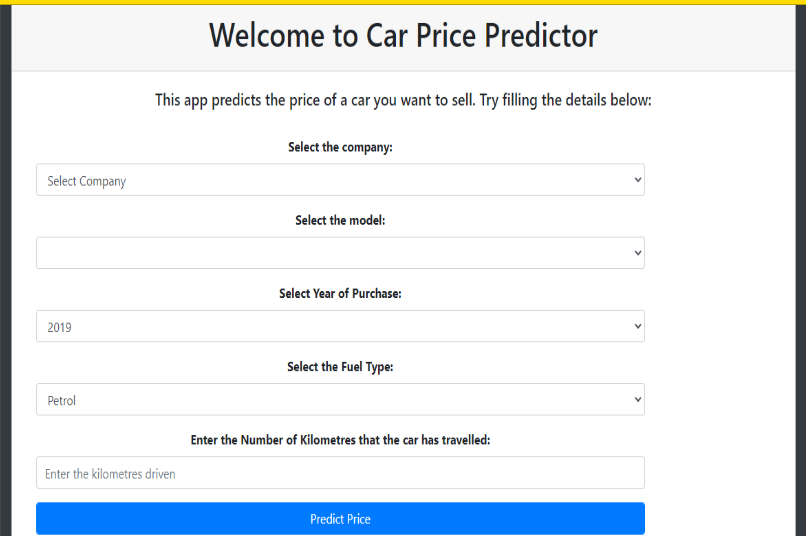
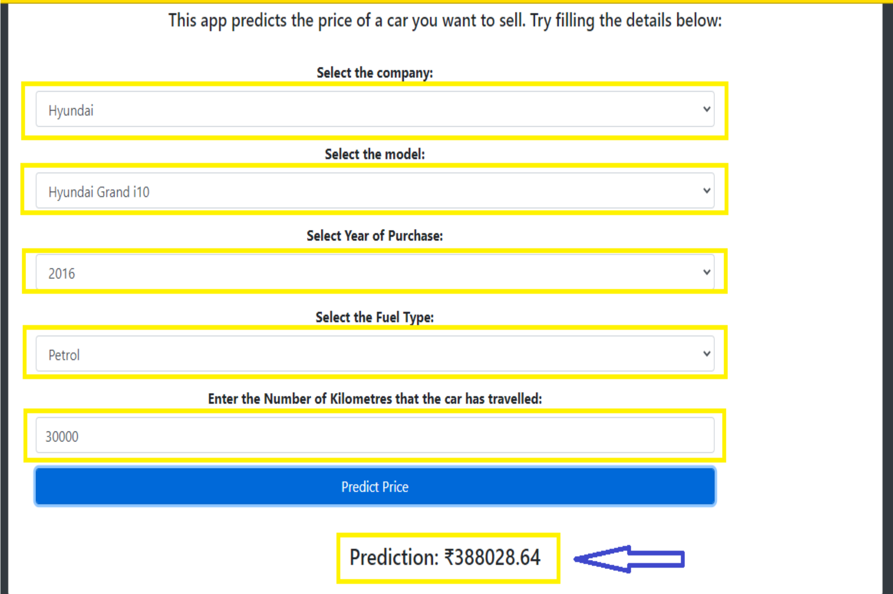

# Car Price Predictor

Project link: https://car-price-price.herokuapp.com

# Aim

This project aims to predict the Price of an used Car by taking it's Company name, it's Model name, Year of Purchase, and other parameters.

  

# Description

## What this project does?

1. This project takes the parameters of an used car like: Company name, Model name, Year of Purchase, Fuel Type and Number of Kilometers it has been driven.
2. It then predicts the possible price of the car. For example, the image below shows the predicted price of our Hyundai Grand i10. 

